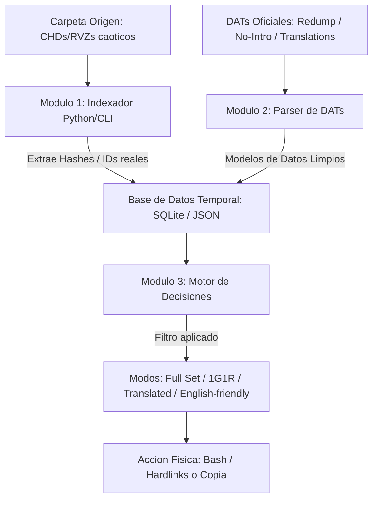

# Preparación de romsets — Pipeline propio (tools/scripts)

Documenta el pipeline de scripts ya existente en `tools/scripts/` (estado actual) y recoge las ampliaciones propuestas para una futura herramienta propia más completa (roadmap), combinando lo que ya funciona hoy con las ideas evaluadas para curación avanzada (modos de set, lectura de CHD/RVZ por hash, traducciones).

## Estado actual — pipeline de metadatos (DAT → dat-index → docs)

Orden de ejecución habitual:

1. **`create-roms-structure.ps1`** — crea el esqueleto de `data/roms` (una carpeta por sistema, `gamelist.xml` vacío y subcarpetas `media/`), configuración inicial independiente del resto.
2. **`build-dat-index-nointro.ps1`** / **`build-dat-index-redump.ps1`** / **`build-dat-index-tosec.ps1`** / **`build-dat-index-1g1r.ps1`** — leen los DAT en bruto (`metadata/dat/` o los curados de `data/dats/console/1g1r/`) y generan `metadata/dat-index/<id>.json` (más `aliases/<id>.json` en los tres primeros). Comparten el mismo esquema de salida pero cada uno agrupa familias parent/clone de forma distinta según el formato: `cloneofid` (No-Intro/Non-Redump), clonelist JSON por nombre base (Redump) o convención TOSEC.
3. **`filter-by-title-type.ps1`** — post-proceso que recorta `dat-index/<TargetSystemId>.json` dejando solo familias con prefijos de tipo de título permitidos (uso documentado: 3DS/DSiWare); debe re-ejecutarse tras cada regeneración del sistema con `build-dat-index-nointro.ps1`.
4. **`filter-cross-system-duplicates.ps1`** — post-proceso que elimina de un sistema destino las familias ya presentes en un sistema base (uso documentado: quitar de `3dseshop.json` lo que ya existe en `3ds.json`).
5. **`find-1g1r-duplicates.ps1`** / **`inspect-dat-index.ps1`** — herramientas de QA de solo lectura sobre `dat-index/<id>.json`: nombres duplicados en un set 1G1R, o informe de familias sin región/distribución de categorías.
6. **`generate-romset-docs.ps1`** — última etapa: genera/actualiza la sección auto-generada de `docs/guides/romsets/systems/<id>.md` y el índice de `systems/README.md` a partir de `dat-index/<id>.json`.

## Estado actual — pipeline de ROMs físicas

Independiente del pipeline de metadatos, opera directamente sobre archivos de ROM:

1. **`build-complete-romset.ps1`** — copia el romset "completo" de un sistema (aplanado a un nivel, excluyendo `_SD`/`duplicates`/`raw`) más el contenido de `_extra/<sistema>`, a una carpeta de staging.
2. **`promote-complete-romset.ps1`** — promueve esa carpeta de staging a la ubicación final, sustituyendo el contenido previo; es dry-run por defecto, solo actúa con `-Execute`.

## Utilidades independientes / one-off

- **`strip-retool-tag.ps1`** — limpieza de nombres de fichero bajo `data/dats`, quita el sufijo `(Retool ...)` añadido por retool.
- **`add-wikipedia-refs.ps1`** — script de un solo uso que insertó la sección "Fuentes de referencia" en los `systems/<id>.md`.
- **`fix-wikipedia-refs-blank-line.ps1`** — corrección de un defecto introducido por el script anterior (línea en blanco faltante); también de un solo uso.
- **`test-wiki-match-gamegear.ps1`** — script de prueba puntual para medir el ratio de coincidencia entre Wikipedia y `dat-index/gamegear.json`; depende de un fichero de scratchpad de una sesión anterior y no es ejecutable tal cual sin ese fichero.

## Roadmap — ampliaciones propuestas

Ideas evaluadas para una herramienta propia más ambiciosa, apoyándose en lo que ya existe arriba en vez de partir de cero:

### Modos de set

Además del 1G1R actual (vía retool, paso 2), se plantean perfiles de salida adicionales sobre el mismo `dat-index`:

- **Full Set** — todo el catálogo renombrado, sin descartar clones.
- **1G1R** — ya cubierto por `build-dat-index-1g1r.ps1` + retool.
- **English-friendly / Import-friendly** — para catálogos con mucho contenido japonés no traducido (PC Engine, Saturn, PSX): whitelist de títulos jugables sin conocer japonés (géneros como shooters o lucha) cruzando el ID/hash del juego contra un listado curado, frente a títulos dependientes de texto (RPG, novelas visuales) que se excluyen.
- **Translated** — identificar la ROM limpia (No-Intro/Redump), localizar un parche asociado (`.ips`/`.bps`/`.xdelta`) y aplicarlo con una herramienta CLI de parcheo (Flips, xdelta) integrada en el pipeline, verificando el hash de salida contra un DAT de traducciones antes de renombrar con etiqueta `[T-En]`/`[T-Es]`.

### Extracción de metadatos en formatos comprimidos

Los formatos CHD y RVZ no se pueden identificar por nombre de archivo; requieren invocar la herramienta oficial correspondiente:

- **CHD** — `chdman info -i "juego.chd"` devuelve el SHA-1 real de los datos, usable para cruzar contra el DAT sin depender del nombre de archivo (ver detalle en [optical-chd.md](optical-chd.md)).
- **RVZ** — `dolphin-tool header -i "juego.rvz"` (corregido: el subcomando real es `header`, no `read-id`) devuelve el `Game ID` de 6 caracteres (ej. `GALE01`, confirmado en la documentación oficial), cruzable contra `wiitdb.txt` (base de datos de nombres de Nintendo) para renombrar y clasificar (ver detalle en [optical-chd.md](optical-chd.md#caso-especial--gamecube--wii-rvz-en-vez-de-chd)).

### Fuentes de datos adicionales a evaluar

- **API pública de RetroAchievements** — como fuente de clasificación de dificultad de idioma/jugabilidad para el modo English-friendly.
- **DATs de romhacking.net / proyectos comunitarios de traducciones** — hashes MD5/SHA-1 del resultado ya parcheado, para el modo Translated.
- **`wiitdb.txt`** — base de datos de nombres oficiales de GameCube/Wii por GameID.

### Arquitectura de pipeline propuesta

1. **Indexación** — escanear la carpeta del usuario; para CHD/RVZ extraer SHA-1/GameID vía CLI externa (`chdman`, `DolphinTool`), para el resto calcular el hash directamente.
2. **Emparejamiento** — cruzar los hashes contra el `dat-index` ya existente (en memoria, tabla hash) en vez de reimplementar el parseo de DAT.
3. **Árbol de decisión por modo** — Full Set copia todo renombrado; 1G1R aplica las reglas de región/exclusión ya usadas por retool; Translated busca parche asociado, lo aplica y renombra con la etiqueta correspondiente.

### Arquitectura en WSL (Python + Bash)

División en módulos independientes en vez de un script monolítico: Python para la lógica pesada (parseo de DATs, consultas, filtros de prioridad de región/idioma) y Bash para la orquestación del sistema de archivos (invocar `chdman`/`dolphin-emu-tool`, mover/copiar en masa).



### Prototipo Python — extracción de metadatos (CHD / RVZ)

Wrappers que ejecutan las CLI oficiales en segundo plano y capturan `stdout`, en vez de depender del nombre de archivo:

```python
import subprocess
import re

def get_chd_sha1(chd_path: str) -> str:
    """Extrae el SHA-1 original del juego dentro de un archivo CHD."""
    try:
        result = subprocess.run(
            ['chdman', 'info', '-i', chd_path],
            capture_output=True, text=True, check=True
        )
        match = re.search(r'SHA1:\s+([a-f0-9]{40})', result.stdout, re.IGNORECASE)
        return match.group(1) if match else None
    except subprocess.CalledProcessError:
        return None

def get_rvz_game_id(rvz_path: str) -> str:
    """Extrae el GameID de 6 caracteres de un archivo RVZ de GameCube/Wii."""
    try:
        result = subprocess.run(
            ['dolphin-tool', 'header', '-i', rvz_path],
            capture_output=True, text=True, check=True
        )
        match = re.search(r'Game ID:\s+(\w{6})', result.stdout)
        return match.group(1) if match else None
    except subprocess.CalledProcessError:
        return None
```

### Implementación de los modos de curación (apoyo de IA)

Al usar IA para generar código o clasificaciones, conviene estructurar el prompt por modo:

- **1G1R** — agrupar por `cloneof` (DATs MAME) o por nombre raíz antes del paréntesis de región (No-Intro/Redump); orden de prioridad estricto configurable (ej. `(Spain)`/`(Europe)` con español → `(USA)` → `(World)`), descartando betas/demos.
- **English-friendly / Import-friendly** — usar la IA para pre-clasificar catálogos exclusivos de Japón en niveles de dificultad de idioma (`0` no requiere texto — arcade/lucha/shooter; `1` jugable con guía básica — acción/plataformas; `2` injugable sin japonés — RPG/novela visual) y usar ese resultado como whitelist de filtrado.
- **Translated** — no almacenar ROMs ya parcheadas: guardar la ROM limpia más una carpeta de parches (`.bps`/`.xdelta`) y automatizar el parcheo en el pipeline:

```bash
xdelta3 -d -s "rom_original.bin" "traduccion_es.xdelta" "rom_traducida.bin"
```

### Notas sobre WSL

- **Rendimiento de almacenamiento** — evitar procesar directamente en rutas de Windows montadas en WSL (`/mnt/c/`); el cálculo de hashes en archivos grandes (ISO, CHD) se ralentiza drásticamente por el protocolo de interoperabilidad. Mover el romset al sistema de archivos nativo de WSL (`/home/usuario/roms/`) o procesar con Python nativo en Windows si los archivos no se van a mover de disco.
- **Dependencias en Ubuntu/WSL**:

```bash
sudo apt update
sudo apt install mame-tools xdelta3  # chdman viene incluido en mame-tools
```

## Notas

[TODO]
